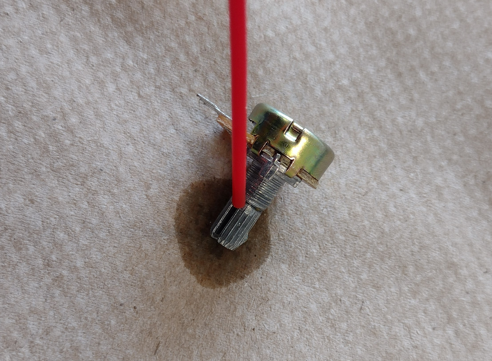

# Build Guide

# Parts

For this guide you will need to print various parts found in this repo and in the protogloves repo. A print list file is provided and a copy of protogloves can be found in this repo. A list of tools needed are also included. The only non printed parts are an esp32, 5 potentiometers, pair of gloves (stretchy magicgloves recommended) and an optional joystick and 6mm pushbuttons.

It took me about 6 hours to build the second glove while making this guide. Also about 160 g of filament and 18h of printing. 

I recommend using the glued version as it is faster to make. I also recommend using stretchy magicgloves or similar glove.

## Printing

All parts have a sensible orientation to be printed without supports. Default settings on a 0.4 mm nozzle work. I recommend a raft on all parts. If printing the glue guides print mostly the XL guides as they glue the best

## Tools 

You will need superglue, hotglue, sandpaper, needle nose pliers, wd-40, soldering station, wire and  twist ties(for cable management). A sewing needle and thread are needed for the sewn guides as well as drill bits for creating holes to thread in the 3d printed parts(or you could modify the stl. I would appreciate a pull request with those)

# Build Guide

## Making the Rack Units

### Lubricate the Potentiometers

Resistanceless operation of the potentiometers is required for the gloves to work. 

Lay down a paper towel to catch drips. Spray WD-40 into the top of the potentiometer and spin back and forth to work it in. Repeat until it spins freely and for each potentiometer.

### Glue Racks and Fingerline

Sand the end of the rack and the Fingerline to prep for superglue.

Apply a dab of superglue to the slot on the rack and press the end of the fingerline onto it. Make sure it is straight and you are gluing the slightly more narrow end of the fingerline to the rack

Sand the edges and sides of the new rack unit to ensure it slides smoothly. More sanding or a reprint may be needed if tolerances were poor but that is unlikely

### Assemble the Rack Unit

Note: the potentiometer can sit in 2 positions allowing you to mirror it for a cleaner final product. 

Insert the potentiometer neck through the unit body. It should skew the gear and locking nut included with your potentiometer. Take care that the gear is oriented correctly when doing this or it will not fully insert. 

Start threading the nut on but do not tighten it yet. It should be just barely on so that you can still rotate the potentiometer body free of the unit body.

Rotate the potentiometer fully counterclockwise and rotate the potentiometer body by 45 degrees counterclockwise relative to the rack unit

Insert the rack into the body and rotate the potentiometer into the seated position. Tighten the nut using the pliers. If assembled correctly the Fingerline will be sticking out the opposite side of the connectors and the potentiometer will stop rotating before the rack falls out. Make sure it moves freely and sand if necessary.

## Attaching Mounts

There are 2 ways to attach the mounting hardware. One is hotgluing it to the glove. This is fast and permanent. The other is sewing them on. This takes some more time but can be removed. I recommend gluing as it is fast and the Fingerline guides and proto glove parts make it easy to still repair and modify.

## Gluing

It is important to apply the guides while wearing the glove so that it aligns properly. You also only get one shot to apply it.

While wearing the glove find a good position for the mounting plate and mark it (use tape or marker). Apply a thick hot glue line to the back of the mounting plate taking care not to add to where mounting holes or joints are(see image for recommended placement). Lay and press the mounting plate onto the glove while wearing it. Make sure the glue is hot and it is properly aligned as you only get one shot. 

While wearing the glove find the appropriate size of glue guide for each finger. Xl for most fingers, possibly L for the pinky. Apply a thick bead of hot glue to the back and press onto the top of each finger equal distance from each joint. Make sure it is straight and in the middle as you only get one shot. I recommend putting the bottom joint on the index finger a little lower to not interfere with a joystick ring. 

Apply a bead of hot glue to the thumb plate and press in place like the main mounting plate.

## Sewing

Sewing on the guides while wearing it is recommended to align it properly (I know one handed sewing is a pain).

Drill out holes in the required places (see images)

Sew the guides in place while wearing. The guides should be in the center between two joints. I recommend putting the bottom joint on the index finger a little lower to not interfere with a joystick ring. 

## Mounting the Hardware

Sand the front of the glove mounting plate, back and front of plate modules, and the bottom of the rack unit to prep them for gluing.

### Attach the plate modules

Apply a tiny amount of superglue to each of the plate modules on the bottom and around the snap connector. This glue will stop them from coming loose but can be broken with some prying. 

Snap each one in place on the back row of mounting points. Trimming the edges of a couple may be needed to get them to fit.

### Attaching the Rack Units

While wearing the glove push a fingerline through all of the guides and see what rotation it naturally wants to sit at. Experiment with mirroring it so that they all can fit side by side without much bending or overhang. Once you find a good position mark where they sit on the mounting points and apply superglue to fix them in place. Some overhang is fine. Below is an example of a “good” layout(I accidentally pushed them back too far towards the wrist so move them forward a little bit yourself) 

### Setting Finger Length

To fix the end of the fingerline to the end guide 

Push the rack to the fully retracted position and bend your finger backwards to fully extend it. Trim the end of the fingerline flush with the end guide. Keep the trimmings(I did not cut flush in the image. my bad). Repeat for each finger. 

Add a peice of trimming to the pinky side to stop the fingerline from sliding over the edge

Take off the glove and sand the top face of the fingerline and the trimming to prep for gluing. Cut the trimmings into small lengths just a little longer than they are wide. Superglue the trimmings onto the end of the fingerline to serve as a stop. Superglue more trimmings onto the other side of the end guide to serve as a stopfor that end. These trimmings can be twisted off without issue for easy replacement.

### Attaching Esp Case

Sand and superglue the esp beside the thumb. Make sure the usb port is down. Make sure the lid fits. You may need to drill the button hole larger or wrap tape around the bottom of the button to increase diameter so it does not fall out.

## Buttons

Apply a dab of superglue to the button bottom and attach  to the housing

Hot glue or sew the mounting plate to the end of the index finger. It should be slightly towards the bottom but you can find where is comfortable. I sewed it for convience

Superglue the buttons to the plate. The open end should be towards the thumb.

## Joystick

Use 8mm 3M screws to attach the joystick to the mounting plate or glue it. It is recommended to attach it to the holes closest to the pins. Slide the controller ring onto your index finger. The gap should be on the bottom of your hand and the flat part should face towards your thumb. You can rotate the gap around the mounted fingerline get it to fit. Hot glue the joystick to the controller ring so that the pins are facing down towards your palm. Add a small dab of hot glue on the side of the joystick rod and insert the new joystick on top(the shorter joystick makes it more comfortable). Coat the top of the nub in hot glue to make it gripy. pictured is a right joystick

# Wiring

Wire the potentiometers all positive to the top and negative to the bottom. Wire the thumb potentiometer to the esp vcc and ground Attach a wire to the output of each potentiometers that is long enough to reach the esp32. Moving your thumb and hand to test this length in all positions.

For the joystick it is recommended to use a pre-crimped jst connector to wire back to the esp and have it share vcc and ground with the potentiometers.

The buttons can be wired by leaching a ground off of the joystick. Solder a wire to one the mounting pins on the joystick and to a button. Make sure there is enough wire when your finger is curled and extended. Solder the two push buttons together to share a ground. Run a wire from each button back to the esp32. Make sure there is enough wire when the finger is bent and extended. Add a wire guide to the joystick to help keep the wires in check. In the example I have created a wire gap for routing by making a hot glue bridge. Glue down the solder joints to prevent them from wearing and snapping during use. 

