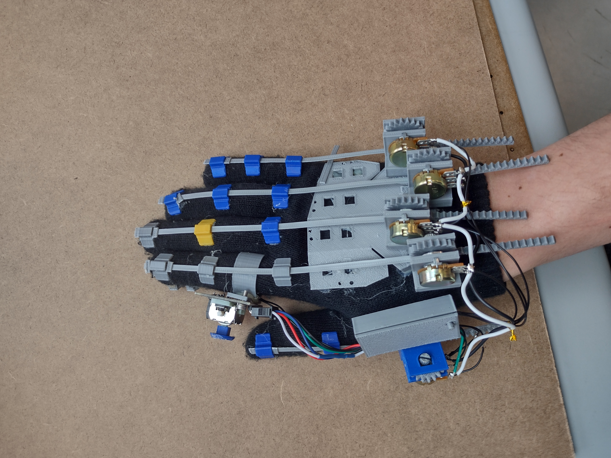

# RackGloves

Simple, cheap and, working glove harware for vr finger tracking using opengloves and lucidvr. This has the advantage of having the bare minimum of assembly and minimal parts that you may already have on hand. It works by a flexible strip on the back that has its horizontal motion actuate a rack on a pot. It uses version 3 of the software so tracking only. Only minimal assembly and parts needed.

Joystick ring mount, button mount, and esp32 case are also in this repo.

NOTE: things are currently in a beta state. May not work the best but it should get you from start to finish. Any improvements are welcome. See pull request for bata and incomplete additions 

# Build Guide

 We have a comprehensive [build guide](Build_Guide.md) and all the necessary stls here. Additional parts can be found from the [protoloves repo](https://github.com/Valsvirtuals/ProtoGlove) and from other [community designs](https://github.com/LucidVR/lucidgloves/wiki/Community-Design-List). 

# Software

Take the esp software from the [Lucidgloves repo](https://github.com/LucidVR/lucidgloves) and it will communicate with the [Opengloves software](https://github.com/LucidVR/opengloves-driver) for steam vr.
